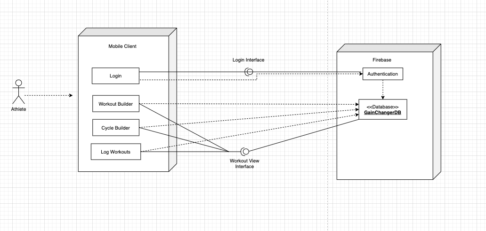

# GainChanger

## Style Guilde
[Airbnb Javascript Style Guide](https://github.com/airbnb/javascript)



## Installing the app
(Include a link apk that will download the app on their phone)
(This app is optimized for iPhone X and later)

## Set-up Instructions
#### Setting up the App
1. clone the repository with ``` git clone https://github.com/jpoist97/GainChanger.git ```
2. navigate to the projects root
3. Run ```npm i``` (to install all of the project dependencies)
4. Install the Expo Go app on your phone. 
5. run npm start

#### Setting up the testing environment


### Overview

#### Purpose

#### Team

<p float="left">
  <a href="https://github.com/jpoist97" target="_blank"></a>
  <a href="https://github.com/ctperry0301" target="_blank"></a>
  <a href="https://github.com/finlaylp" target="_blank"></a>
  <a href="https://github.com/rohithdara" target="_blank"></a>
  <a href="https://github.com/shriyan44" target="_blank"></a>
  
  
</p>

(From left to right)
- Justin Poist
- Cole Perry
- Finlay Piroth 
- Rohith Dara
- Shriya Nimmagadda
